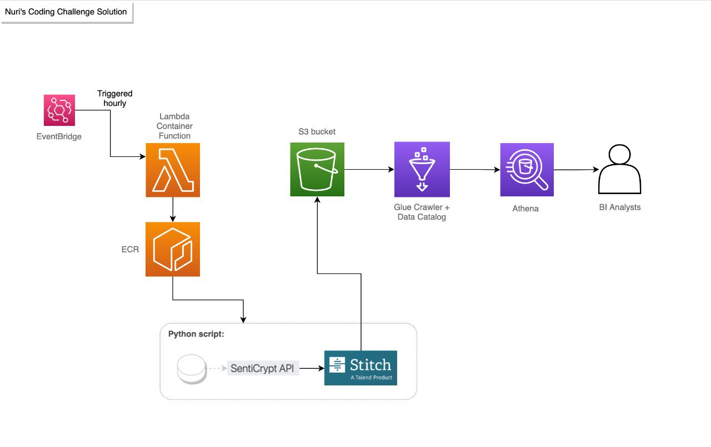

# Stitch ETL test

## The test

To test Stitch ETL tool, I wrote a Python script to pull market sentiment data from [SentiCrypt API](https://senticrypt.com/) and push it to [Stitch Import API](https://www.stitchdata.com/docs/developers/import-api/). Then connected Stitch via UI to an AWS S3 bucket.
 <br /><br />

## The solution's architecture

I deployed the solution as an AWS Lambda Container Function triggered hourly by AWS EventBridge, running a Docker Image stored on AWS ECR. This image contains a Python script that pulls data from SentiCrypt API and pushes it to Stitch Import API. The Python script also runs two simple validation tests to check for null and duplicated IDs. 
 <br /><br />
Stitch then does the upsert and loads the data to an AWS S3 bucket. Next, the data is crawled by AWS Glue Crawler, which will create a Data Catalog that enables it to be queried by AWS Athena. <br /><br />



<br />

## This repository 

| Content                  | Description |
| ------                   | ------ |
| [images]()               | folder with the images used on readme |
| [docker-compose.yml]()   | docker-compose file |
| [Dockerfile]()           | dockerfile |
| [push.py]()              | script that pulls data from SentiCrypt API and pushes it to Stitch Import API |
| [query_validation.sql]() | validation queries to check on empty, null and duplicated values |
| [requirements.txt]()     | requirements to run push.py|

<br />

## Replicating the solution 

To run the [Docker image](Dockerfile) locally, create a .env file with the following environment variables:<br />
Note: `STITCH_REGION` should be either 'eu' or 'us'. For more information on how to set the environment, check the [Stitch Documentation](https://www.stitchdata.com/docs/developers/import-api/guides/quick-start).<br />
```
 STITCH_CLIENT_ID = 
 STITCH_TOKEN = 
 STITCH_REGION = 
```

Now, you can run `docker-compose up` from the project root directory to build and run a Docker container that will run the script.

<br />

## Important assumptions and decisions made 

### Python script

Because this data is aggregated by `timestamp`, I chose to create a validation function to check if there are any null or empty timestamps before loading the data.
 <br /><br />

I also decided to check the field `count`. This field is supposed to return the number of sentiments analyzed in a specific window of time. So if its value is equal to or lower than 0, the rest of the fields should contain invalid data.
 <br /><br />

There is only one new field added in this step:
- `datetime` - added to the Push Message because I was unable to convert `timestamp` to a date/timestamp type with SQL. This happened due to the type attributed to `timestamp` by Glue (string). I decided to keep the original field for debug purposes, since it's more precise. 
 <br /><br />

In the Push Message that gets sent to Stitch Import API, I chose to sequence the data using current datetime to ensure that every matching `timestamp` gets updated with the most recent extract. Stitch uses the `sequence` value and the defined keys to de-duplicate data, so in the lack of a better unique identifier, `timestamp` was used as primary key.


### Queries

When loading the data to S3, Stitch adds new fields that cause duplications: `_sdc_batched_at`, `_sdc_received_at`. This was handled doing an inner join that considers only the maximum `_sdc_batched_at` for each `timestamp`.

Two validation queries were created in order to make sure there was no duplicated, empty or null 'timestamps'.

Three fields were created in the BI Analysts query:
 - `date_utc` - date field created from `datetime` to facilitate date aggregations.
 - `time_utc` - time field (%H:%i:%s) created from `datetime` to facilitate time aggregations.
 - `median_sentiment` - represents the numeric `median` field with text values such as 'positive','neutral','negative'. It was created to facilitate categorical analysis. 

Some fields were not included in the BI Analysts query:
 - `_sdc_batched_at`, `_sdc_received_at`, `_sdc_sequence`, `_sdc_table_version` - these are added by Stitch to monitor the load, most likely not useful for BI Analysts.
 - `last` - according to SentiCrypt documentation, "this is not very useful and primarily for debugging", so it's also most likely not useful for BI Analysts.

<br />

## Future improvements
 
- I would add a transformation step to the pipeline to deal with the duplications. This would lower query complexity for BI Analysts and improve its performance.
- I would generate a unique identifier by hashing some of the data, which could be more reliable than `timestamp`.

